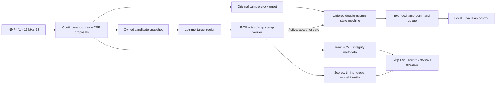

# Clap Lights

**Local double-clap and finger-snap control with an ESP32, continuous audio capture, and an on-device AI verifier.**

Clap Lights combines embedded signal processing, a compact INT8 neural network, a recording and evaluation workflow, and local smart-lamp control. An INMP441 microphone supplies audio to a dual-core ESP32. A lightweight detector proposes sharp sounds; a classifier can reject unsuitable proposals before the double-gesture state machine sends a local Tuya command.

The project has progressed from threshold-based control to a room-adapted model running on real hardware. Recorded replay suppresses **close-bag false double gestures while preserving the existing clap and snap pairs** at two measured detector thresholds. That bag recording and the positive recordings were used for training. Separate held-out bag recordings were also rejected, but independent positive accuracy and sustained false-toggle rates remain unmeasured.

## Current status

The current local deployment uses an **experimental active AI veto**. Explicit shadow and DSP-only builds provide comparisons and fallback. A recent qualitative live trial was reported as successful; it is not a counted sensitivity test. The selected INT8 model and its frontend constants are included so a fresh checkout can run AI without training. Raw recordings, training datasets, checkpoints, and deployment credentials are excluded. Begin with [the deployment guide](docs/GETTING_STARTED.md) and verify the supplied model in your own room before enabling its veto.

| Evidence | Result | What it establishes |
|---|---|---|
| Current room model | 13,527 parameters; 20,872-byte INT8 model | A compact, real three-class deployment artifact |
| Close bag replay | 7 DSP doubles → 0 at the newer boot threshold; 13 → 0 at the recording threshold | Training-recording fit of the complete detector/model/pairer pipeline |
| Positive replay | 2 clap pairs and 9 snap pairs preserved | Preservation on the supplied training-positive recordings |
| Held-out bag replay | 0 / 43 and 0 / 27 candidates approved at the newer boot threshold | Rejection on two separate held-out bag recordings |
| ESP32 allocation | 32 KiB arena; 18,076 bytes used | The selected model runs without PSRAM |
| Device computation | About 18 ms frontend + 115 ms inference | Measured worker execution; not lamp response time |
| Two-viewer stream check | 20.02 seconds; no additional gaps or drops | Short simultaneous audio/network continuity |
| Automated checks | 123 Python/C++/privacy checks and 10 recording/server checks passed | Verified software paths; [complete validation record](TEST_RESULTS.md) |

The preserved public-data model performed poorly at its conservative threshold: it accepted only **14.11% of clap windows and 30.90% of snap windows**, with **1.35% noise acceptance**. Those failures informed the room-adaptation work. Model size, classification accuracy, training fit, and live reliability are reported separately throughout the documentation. [The experiment history](docs/EXPERIMENT_HISTORY.md) shows the model evolution and unsuccessful attempts alongside the selected result.

## Architecture

The latest recovery build compiles at **1,161,072 program bytes (88%)** and
**65,912 static RAM bytes**. It adds bounded stream handshakes and automatic
startup/lamp recovery. Its upload and physical restart tests are pending because
the board is currently absent from USB. The device results above belong to the
preceding room-model firmware; see [the validation record](TEST_RESULTS.md).



Capture and DSP run at higher priority on core 1. The inference worker also runs on core 1 at lower priority, using the time capture spends waiting for I2S data. Networking, lamp communication, and local web services run on core 0. Queues and immutable snapshots let these tasks cooperate without pausing microphone capture for inference.

Both cores share RAM. Task placement improves overlap and responsiveness; it does not double available memory or automatically halve inference time. Memory savings came from measuring which audio and features the model actually consumes: the worker now stores only **80 ms before and 100 ms after** a candidate, saving **40,960 bytes of PCM storage** and computing **16 FFT frames instead of 48**.

The logical model input remains `[1,64,48,1]`. The model crops frames 32–47 before its convolutions, so a previous clap elsewhere in the history cannot validate a subsequent noise event. The pairer uses original onset timestamps rather than inference completion times. Accepted impulses 150–800 ms apart form a pair; the present policy also accepts a mixed clap/snap pair. Slam, echo, first-impulse, and refractory protections remain in place.

## What is implemented

- Continuous sample-based transient detection and gesture pairing, with explicit reset after an audio discontinuity.
- Real TensorFlow Lite Micro inference, model identity checks, fixed candidate ownership, bounded queues, and adaptive arena allocation.
- Active, shadow, and DSP-only comparison modes. Shadow mode reports predictions while DSP controls the lamp.
- Local lamp on/off, brightness, and white-temperature control through Tuya LAN communication.
- Password-protected live listening and a browser recording Lab with label selection, playback, event review, and verified Save completion.
- Raw PCM capture independent of monitoring gain, with sample offsets, missing-packet checks, upload ordering, and training-readiness metadata.
- Source-aware data preparation, train-only augmentation, domain/source balancing, provenance-checked fine-tuning, and function-preserving channel widening.
- Training-only quantization calibration, validation-only threshold selection, class/domain metrics, and full-recording replay through the actual C++ detector and pairer.

## Hardware and software

The tested target is a classic dual-core ESP32 at 240 MHz with an INMP441 digital microphone. No PSRAM is required. The lamp uses local Tuya 3.5 communication. Microphone wiring follows the canonical sketch:

| INMP441 signal | ESP32 GPIO |
|---|---:|
| BCLK | 18 |
| WS / LRCLK | 15 |
| SD / audio input | 19 |

The tested firmware toolchain is **Arduino CLI 1.5.1** with **Arduino-ESP32 3.3.11**, using the standard ESP32 Dev Module flash layout. This board package includes the modern TFLM/ESP-NN runtime; a separate legacy `TensorFlowLite_ESP32` library is unnecessary. Node.js runs the local recording Lab. Python 3.10, PyTorch, NumPy, and SciPy support preparation/training; TensorFlow is required for export. A host C++ compiler is required for native firmware tests.

## Run locally

1. Use the canonical sketch at [clap_double/clap_double.ino](clap_double/clap_double.ino). The root `.ino` redirects to it to prevent stale uploads.
2. Copy [clap_double/clap_local.example.h](clap_double/clap_local.example.h) to `clap_double/clap_local.h` and supply your own deployment values. The local file is ignored. `CLAP_WIFI_SSID` / `CLAP_WIFI_PASSWORD` configure Wi-Fi; `CLAP_TUYA_DEVICE_ID` / `CLAP_TUYA_LOCAL_KEY` identify the lamp. `CLAP_TUYA_IP` is four comma-separated octets; `0,0,0,0` selects discovery. Leaving optional `CLAP_LAB_PASSWORD` empty generates or retains the board's access password.
3. Install the tested Arduino board package and start with **shadow mode**. The included [model_data.h](clap_double/model_data.h) supplies the selected INT8 verifier. Shadow mode computes scores while the existing DSP controls the lamp; active mode adds the veto. DSP-only mode disables AI allocations. Evaluate either the supplied model or a new model locally before enabling its veto.

```powershell
# Build only. Modes: shadow, active, dsp.
./tools/build_firmware.ps1 -Mode shadow

# Replace <SERIAL_PORT> with your connected board's port.
./tools/build_firmware.ps1 -Mode shadow -Upload -Port <SERIAL_PORT>

# Start the recording interface.
node lab/server.js
```

Open the local Lab address printed by the server and connect using the board address and access password from your own deployment. `lab/START.bat` provides the same Windows entry point. The PC recording server binds to this computer only by default. Explicit LAN sharing exposes the saved-recording routes without authentication; the board's access password does not protect those PC routes. See [the privacy guide](docs/REPRODUCIBILITY_AND_PRIVACY.md) before opting in.

[tools/sync_firmware.ps1](tools/sync_firmware.ps1) copies the canonical firmware tabs and headers into the Arduino sketch directory, preserves existing files in a local backup, and verifies copied hashes. Direct builds use the repository sketch and do not require this copy.

### Train a public-data baseline

Install the CPU PyTorch wheel and the pinned [training dependencies](requirements_hybrid.txt). Add [export dependencies](requirements_hybrid_export.txt) when converting models. Download and extract the [official ESC-50 dataset](https://github.com/karolpiczak/ESC-50); `<ESC50_DIRECTORY>` must contain `audio/` and `meta/esc50.csv`. The current repository documents real experiment results; local datasets and checkpoints are intentionally excluded.

```powershell
python -m venv .venv-hybrid
./.venv-hybrid/Scripts/python.exe -m pip install torch==2.8.0 --index-url https://download.pytorch.org/whl/cpu
./.venv-hybrid/Scripts/python.exe -m pip install -r requirements_hybrid_export.txt
./.venv-hybrid/Scripts/python.exe -m hybrid.download_fsd50k --output data/fsd50k --positive-count 170 --negative-count 50
./.venv-hybrid/Scripts/python.exe -m hybrid.prepare --fsd50k data/fsd50k --esc50 <ESC50_DIRECTORY> --max-windows-per-file 6
./.venv-hybrid/Scripts/python.exe train_custom.py --epochs 50 --patience 10 --threads 2
./.venv-hybrid/Scripts/python.exe -m hybrid.export
```

After reviewing the export checks and model limitations, use a local branch to replace `clap_double/model_data.h` with your generated `data/hybrid/export/model_data.h`, then build with `-Mode shadow`. This changes the supplied model: rerun conversion, host, and device checks before using it for control. Public data requires its original attribution and license conditions; repository source licensing does not replace them. Exported model headers contain learned parameters and normalization, so review them deliberately before publishing a replacement.

FSD50K acquisition fetches selected ZIP members rather than the entire archive, verifies CRC/SHA256, preserves official splits, and filters uploader conflicts. Selected clips use CC0/CC-BY licenses with attribution stored locally. ESC-50 has its own license conditions. Public clip labels remain weak supervision for isolated intentional gestures.

For room adaptation, collect separately labelled raw takes, review their contents, and preserve capture groups across splits. A successful `trainingReady` capture proves continuity, not its semantic label. Detector events are predictions and must not automatically become ground truth. The exact selected room experiment and commands are in [ROOM_MODEL_STATUS.md](ROOM_MODEL_STATUS.md).

## Verification

```powershell
./.venv-hybrid/Scripts/python.exe -m pytest tests -q
node --test tests/lab_recording.test.js
```

The tests execute the actual portable C++ detector, capture ownership, WebSocket packet handling, and frontend. Golden cases compare C++ and Python features for silence, impulses, tones, random PCM, and clipping. The ML suite checks source/split isolation, normalization, domain weighting, warm-start provenance, widening, float parity, real INT8 conversion, and replay with vetoes. Recording tests cover concurrent Save/upload ordering, failed saves, raw monitoring independence, offsets, and timestamps.

Hardware verification also checks the flashed model hash, synthetic inference goldens, heap/arena use, two-listener streaming continuity, and counters before and after collection. These checks are useful deployment evidence; they do not replace independent gesture trials or long-duration room-noise observation.

## Known limits

- The room positives used for replay were training recordings; independent room-positive validation/test takes are absent.
- The active room threshold accepts 6.94% of public held-out noise windows, or 6.68% of the combined public/room test-noise set. Its improvement on the supplied room takes does not establish broad noise rejection.
- Approximately 64 seconds of held-out bag exposure cannot establish false toggles per hour.
- Quiet streaming and synthetic inference checks establish continuity and plumbing, not live gesture recall or lamp latency.
- Longer reboot/reconnect stability remains under evaluation, including the recent WebSocket upgrade-parser correction.
- The current mixed clap/snap pairing policy, microphone placement, and candidate threshold affect behavior. Very quiet or distant gestures can fail before reaching AI.

## Experiment record and remaining work

[docs/EXPERIMENT_HISTORY.md](docs/EXPERIMENT_HISTORY.md) records the progression, failed models, fixes, and evidence limits. [TEST_RESULTS.md](TEST_RESULTS.md) contains measured host/device checks. [MODEL_STATUS.md](MODEL_STATUS.md) preserves the public baseline; [ROOM_MODEL_STATUS.md](ROOM_MODEL_STATUS.md) describes the selected local adaptation. [HYBRID_AI_PLAN.md](HYBRID_AI_PLAN.md) documents the corrected design and evaluation protocol.

The next measurements are counted live clap/snap success by distance and direction, sustained false toggles under ordinary activity, end-to-end lamp latency, and longer reconnect/reboot stability. Independent room-positive test takes are currently absent. The active room threshold improves the supplied-recording fit but increases public-noise acceptance, so the DSP protections remain essential.

This repository contains source, the selected deployable INT8 model, anonymized aggregate results, and deployment configuration examples. Recordings, datasets, checkpoints, other generated models, features, session metadata, credentials, device addresses, identifiers, and diagnostic logs are excluded. [Reproducibility and privacy](docs/REPRODUCIBILITY_AND_PRIVACY.md) explains the included learned parameters, the reproducibility limits, and publication checks.

Source code is licensed under [MIT](LICENSE). The included model and normalization use [CC BY-NC 4.0](docs/MODEL_LICENSE.md), supporting personal home use and noncommercial study with attribution. [Bundled fonts](lab/fonts/NOTICE.md), training data, and dependencies retain their own licenses. [Contributing](docs/CONTRIBUTING.md) describes the checks required for changes.
