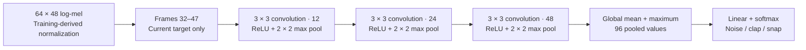

# Room-adapted clap and snap model

Trained 6 October 2026; record updated 7 October 2026. The uploaded local test model learns from this ESP32's raw recordings and adds an AI veto to the existing DSP detector. Recorded replay suppresses close-bag false double gestures at two detector arm thresholds while preserving the old clap/snap pairs. Target-device hash, INT8 goldens, memory and short streaming checks pass, including three EN/reset checks of the recovery firmware. A subsequent live trial received a positive qualitative response; counted fresh-gesture accuracy and sustained close-bag rejection remain unmeasured.

## Artifacts and training

- Model: `data/hybrid/room_v3/export/model.tflite`, **20,872 bytes**, SHA256 `9e9f9dd8c0efee615e9a5d51fc2b6071bb01814d0b3c8e914c6be95b4dba9b94`.
- The deployable weights, normalization, and tensor contract are included in [clap_double/model_data.h](clap_double/model_data.h). Raw audio, training features, checkpoints, and other generated artifacts stay local. A new checkout can run the selected model; exactly repeating its training requires the omitted private recordings.
- Checkpoint: `data/hybrid/room_v3/run/best.pt`, SHA256 `b5de4231c140945f62e3a3a7db3f4d629f8437776310bb96c75d224c5d3a1e86`.
- Dataset: `data/hybrid/room_v1/features.npz`, SHA256 `152a07279aec84990a8424d632ca2743666a513e10b2207a24fc19709420f81b`.
- Classes: noise, clap, finger snap. **13,527 parameters**, convolution widths **12/24/48**, target frames 32–47. Eight supported INT8 operators; no float tensors.
- The public checkpoint and learned normalization are retained, with provenance and split checks. Explicit channel widening preserves its initial inference function while adding trainable channels; tests verify this.
- Best epoch **12**, stopped at 27 of a possible 90. Classes have equal sampling mass, with equal independent-source mass within each domain; room data receives 70% of each class's training probability.

Training-only variations use gain −6 to +6 dB, timing ±10 ms, up to two masked mel bands, bass/treble shelves ±2 dB, and occasional quiet background energy mixing at 20–35 dB SNR. Background sources come only from training. These are new views of existing sounds, not independent recordings. Spectral mixing is an approximation, not exact waveform addition.

Two earlier experiments were not installed for lamp control. The first fine-tune's high threshold suppressed gestures. The second smaller network never simultaneously met room gesture-fit and noise-fit requirements. The selected wider model recognizes all 12 clap and 20 snap training windows while rejecting all 100 room training-noise windows at the 0.85 threshold.

## Architecture and decision



Training BatchNorm parameters are folded into the exported convolutions; dropout is inactive during inference. Firmware normalizes and quantizes the logical input to INT8 with scale `0.017910616472363472` and zero point `-11`; output probabilities have scale `1/256` and zero point `-128`. Only the cropped target frames influence inference.

The verifier accepts a non-timed-out candidate when a gesture beats noise, `1 - p_noise >= 0.85`, `p_noise <= 0.15`, and the target/noise margin meets the configured minimum. The original DSP guards and sample-clock pairer then decide whether it contributes to a double gesture. A classifier score is not itself a lamp command. The preserved public model used the same cropped design with narrower **8/16/32** channels; widening to **12/24/48** changed capacity without changing the input contract or class map.

## Recording provenance and split limits

All five source recordings have raw-v2 PCM, contiguous positions, no recorded drops/errors, and no clipping. The owner verified their sound classes. The take named `clap_far` actually contains close claps; its metadata records that correction.

Training contains one close-clap take (12 reviewed impulse proposals), one snap take (20), and the close bag prefix. The owner identified speech in the bag take's last three seconds. A separate unaltered PCM prefix is used for bag-only training; **the complete original is preserved**, with hash/provenance, and excluded from duplicate training use.

The other bag takes are separate validation and test recordings. There are **no independent room-positive validation or test takes**; the owner declined more clap/snap recording. Positive fit and replay cannot establish generalization to new gestures, positions or rooms. Related augmented views and the bag derivative stay in their original source group and split. Public split boundaries remain intact.

Room features contain 12 clap, 20 snap and 100 training-noise windows, 77 validation-noise windows and 92 test-noise windows.

## INT8 and complete-recording checks

The union-of-gestures threshold is **0.85**, calibrated on INT8 validation with the room-noise domain explicitly selected. Other domains remain reported; room calibration is not a universal 1% noise guarantee. Quantization uses 247 training-only representative windows, including 65 room windows. Float conversion parity error is 0.000000306; maximum validation probability change is 0.0754. Clap gate recall falls by 0.91 percentage points; snap gate recall is unchanged after quantization.

`tools/evaluate_room.py` runs the actual portable C++ detector, classifies each trigger with INT8, then replays the actual pairer with the veto and existing first-impulse/slam/echo protections. The first arm threshold was 281,840, matching the recording device. A second replay uses 181,296, measured at a subsequent hardware boot, without changing the trained model or the 0.85 AI gate. The detector's adaptive floor can change its candidates and pair counts across boots; it must be reported alongside results. PCM16 reconstruction loses the lowest eight raw24 bits. Host replay does not simulate worker queues, radio traffic or lamp latency.

At arm **181,296**:

| Recording | Split | Seconds | AI-approved candidates | DSP doubles | Doubles after veto |
| --- | --- | ---: | ---: | ---: | ---: |
| First bag | Validation | 25.664 | 0 / 43 | 0 | 0 |
| Second bag | Test | 38.528 | 0 / 27 | 0 | 0 |
| Close bag prefix | Training | 30.088 | 0 / 63 | 7 | 0 |
| Close claps | Training | 19.072 | 12 / 12 | 2 | 2 |
| Finger snaps | Training | 15.008 | 20 / 20 | 9 | 9 |

At arm **281,840**, the first and second bags have 25 and 14 candidates, all vetoed. The close bag has 63 candidates and **13 DSP doubles → 0**; positive candidate approvals and pair counts are unchanged. Both local JSON reports are preserved under `data/hybrid/room_v3`.

AI accepts all reviewed target proposals. Existing DSP guards still admit 10 clap and 19 snap candidates; the veto preserves those counts and pairs at both thresholds. Bag exposure totals only 94.28 seconds, including 64.192 seconds from held-out recordings. It does not establish false toggles per hour. The eliminated doubles are detector outputs, not successful lamp-command counts; the close bag and all positives measure training-recording fit.

Both held-out room bag sets have zero accepted candidates. The held-out INT8 feature-window gate has the following breakdown at the selected room threshold:

| Test-noise domain | Accepted / windows | Acceptance |
|---|---:|---:|
| ESC-50 | 154 / 2,322 | 6.63% |
| FSD50K hard negatives | 10 / 42 | 23.81% |
| Public datasets combined | 164 / 2,364 | 6.94% |
| Room bag test | 0 / 92 | 0% |
| All test-noise domains | 164 / 2,456 | 6.68% |

Public clap and snap acceptance are **60.58%** and **57.99%**. These window-gate rates exclude the complete DSP/pairing pipeline. The small FSD hard-negative subset is especially challenging. This is an experimental room veto; keep the conservative DSP protections and measure other noises. Generated export/domain reports preserve full public results.

## Reproduce locally

```powershell
./.venv-hybrid/Scripts/python.exe train_custom.py --data data/hybrid/room_v1/features.npz --out data/hybrid/room_v3/run --init-checkpoint data/hybrid/run/best.pt --init-data data/hybrid/features.npz --allow-widen --widths 12 24 48 --balance-domains --room-weight 0.7 --calibration-noise-domains lab --min-room-fit 0.95 --epochs 90 --patience 15 --threads 2 --learning-rate 0.0005 --eq-db 2 --mix-background --gain-db -6 6 --jitter-frames 1 --frequency-mask-bands 2
./.venv-hybrid/Scripts/python.exe -m hybrid.export --checkpoint data/hybrid/room_v3/run/best.pt --data data/hybrid/room_v1/features.npz --out data/hybrid/room_v3/export
./.venv-hybrid/Scripts/python.exe tools/evaluate_room.py --export data/hybrid/room_v3/export --out data/hybrid/room_v3/replay.json
./tools/build_firmware.ps1 -Mode active
```

The latest recovery firmware is uploaded with flash verification, using the same approved model and a 32 KiB arena (18,076 bytes occupied). All three EN/reset checks reported the expected model hash, matching INT8 synthetic goldens, active AI and live microphone/lamp connections. Their approximately 20-second collections had no additional gaps, metadata errors or drops; startup drop counters are reported separately. The corrected WebSocket handshake also returned a matching pong to a raw masked ping. Two controlled viewers then each streamed for 55.00 seconds with default keepalive enabled and no additional gaps, metadata errors or drops.

After a request to unplug/reconnect USB and try a double clap and a double finger snap, the user replied “it works perfectly.” This follow-up is qualitative: physical power removal was not independently instrumented, and no gesture success counts were supplied. It does not establish universal recognition accuracy or indefinite restart reliability.

Device inference takes about 115 ms plus 18 ms frontend work. These times are not end-to-end lamp latency. Full measurements are in [TEST_RESULTS.md](TEST_RESULTS.md). The approved model header is distributed for deployment; the recordings and training artifacts are excluded. See [the deployment guide](docs/GETTING_STARTED.md) for a fresh board and [reproducibility and privacy](docs/REPRODUCIBILITY_AND_PRIVACY.md) for the included parameters and omitted data.
