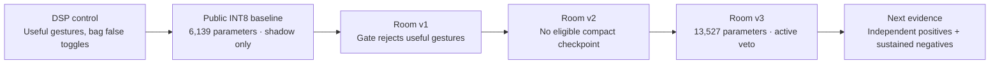
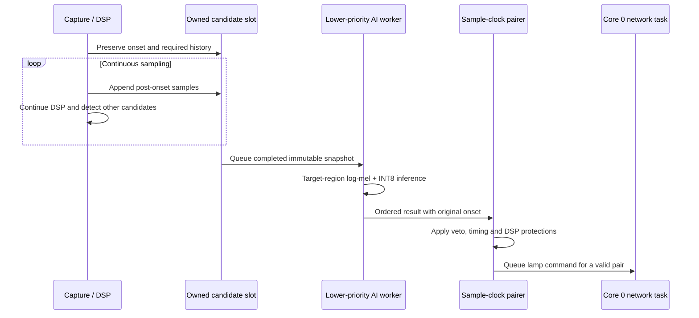

# Experiment history and evidence ledger

This document records how Clap Lights evolved from a threshold detector into an embedded hybrid verifier. Results are separated into **software checks**, **training-recording fit**, **held-out recordings**, **target-device measurements**, and **qualitative live observations**. A result in one category does not establish another.

The measured development record is from October 2026. Recording names below are generic roles; no private take identifiers, network details, or raw recordings are included.

This is a progression of measured experiments, not a claim that each newer model improved every metric. Room v3 improves local training-recording fit but accepts more public noise at its selected threshold.

## 1. Initial detector and the hybrid proposal

The starting system detected transient sounds and required two impulses before issuing a local lamp command. It could control the lamp, but room noises such as close bag handling could satisfy the transient and pairing rules.

The first hybrid plan proposed keeping the DSP as a cheap proposal stage and adding a small CNN to reject noise. That cascade is useful, but several assumptions were unsuitable for a dependable implementation:

| Initial assumption | Why it failed review | Correction |
|---|---|---|
| A DSP proposal guarantees no missed gestures | Quiet sounds below the proposal threshold never reach AI | Evaluate candidate recall and complete gesture recall separately |
| AI guarantees zero false positives | Bags, clicks, percussion, and gestures can overlap acoustically | Measure held-out negatives and full double-gesture outcomes |
| Delay the detector while collecting post-trigger audio | Capture can stall or miss the next impulse | Capture continuously; complete a snapshot and queue inference |
| A small model file implies small RAM usage | Activations, scratch, buffers, stacks, and networking dominate separate budgets | Measure the arena and total internal heap on the target |
| Core separation automatically provides twice the capacity | Cores share RAM and other resources | Use bounded queues, priorities, ownership, and measured contention |
| Four hand-sound classes and three output classes are interchangeable | Training and deployment label maps would disagree | Fix the map to noise, clap, finger snap |
| Most negative sound types can be removed without consequence | Open-world negatives remain capable of triggering the detector | Retain broad public noises and collect local hard negatives |
| Clip windows can be randomly split | Related recordings and augmented views leak across evaluation boundaries | Split by original recording, uploader where available, and capture group |

The corrected plan is [HYBRID_AI_PLAN.md](../HYBRID_AI_PLAN.md). Its zero-error and fixed-latency promises were replaced by an explicit contract and measurements.

## 2. Data and training correctness

Several implementation defects were corrected before trusting training results:

- Integer stereo WAV data had been averaged before normalization. This converted the array to floating point and bypassed integer scaling, causing severe clipping. PCM is now normalized before channel mixing; unsigned PCM receives the correct midpoint offset.
- Energetic fixed windows from a positively labelled session had all inherited the positive class. Preparation now proposes trigger-aligned transients, preserves label quality, and accepts separately verified onset annotations. Automatic proposals remain weak labels.
- Random filename splits did not protect recordings extracted from the same original source. Preparation retains official public splits and source provenance. Two ESC original sources that cross official held-out splits are excluded; duplicate original Freesound IDs across ESC/FSD are also excluded.
- Feature archives lacked enough provenance to audit leakage. The versioned schema now stores sources, groups, domains, labels, frontend metadata, and original public attribution/provenance. Training refuses stale contracts, missing classes, malformed features, and source/group split overlap.
- Majority-class accuracy obscured missed gestures. Training now reports class recall, balanced accuracy, gate acceptance, source-weighted results, and domain breakdowns.
- Recording gain and discontinuous browser uploads could change or corrupt training data. Raw PCM v2 preserves device sample positions, monitoring gain affects playback only, and close/save waits for serialized uploads. Failed or discontinuous captures are review-only.

These are prerequisites for interpreting results; they are not improvements in recognition accuracy by themselves.

## 3. Public-data experiments

### Early binary check

An explicitly experimental noise/clap model was trained for three epochs on a curated ESC subset using official folds. Held-out accuracy was **90.6%**, but clap recall was only **23.4%** and balanced accuracy **61.5%**. The majority noise class made the headline accuracy look better than the gesture behavior.

This binary experiment did not recognize finger snaps and was not a deployable substitute for the required three-class model.

### Public three-class baseline

FSD50K provided genuine finger-snap recordings absent from ESC-50. Selective ZIP range extraction acquired 388 licensed clips: 170 claps, 168 snaps, and 50 hard negatives, from 249 uploaders. CRC32, SHA256, PCM format, official split preservation, uploader/source isolation, and zero-network cache reuse were verified. Broader ESC negatives were retained.

The final compact public model used widths 8/16/32, **6,139 parameters**, and a **12,752-byte INT8 artifact**. It requested 50 epochs and stopped after 36; validation selected epoch 26. Class/source-balanced sampling prevented a long recording from dominating training. Gain, timing, and narrow frequency masks produced training-only views.

| Public baseline result | Measurement |
|---|---:|
| Held-out INT8 classification accuracy | 78.72% |
| Held-out balanced classification accuracy | 64.38% |
| Gate acceptance of clap windows | 14.11% |
| Gate acceptance of snap windows | 30.90% |
| Noise windows accepted by the gate | 32 / 2,364 = 1.35% |
| FSD-only hard-negative acceptance, float | 4 / 42 = 9.52% |

The validation-calibrated threshold was about 0.918. The model's low gesture acceptance and worse hard-negative subset made an active veto inappropriate. It was installed in **shadow mode**, where predictions could be observed without suppressing DSP control.

This was a genuine trained model and a useful failure: public applause and mixed-sound labels did not translate into reliable isolated-gesture recognition on the deployment microphone. More epochs alone would not repair weak labels or domain mismatch. Full metadata and fixed results are preserved in [MODEL_STATUS.md](../MODEL_STATUS.md).

## 4. Target-specific windowing and concurrency

The 500 ms logical feature window initially risked allowing an earlier clap to validate a later noise event. The model now crops frames 32–47 **before convolution**. An invariance test changes every earlier feature and verifies unchanged predictions. The retained region covers approximately 80 ms before the current trigger and 100 ms afterward; reverberation inside it remains a real negative-testing problem.

The producer does not wait for inference. Three slots have explicit ownership; queue overflow, invalid results, missing samples, and timeouts are observable rejection/reset conditions. The pairer uses acoustic onset spacing, rather than the variable time inference completes.

Using only the model's required audio reduced storage from three full 8,000-sample windows plus full history to three 2,880-sample windows plus 1,280 history samples. This saved **40,960 bytes**. Computing only retained frames reduced FFT work from 48 frames to 16 without changing retained tensor inputs. This optimization retained the logical `[1,64,48,1]` interface and was tested against the full frontend.

Capture/DSP and AI share core 1 at different priorities; networking and lamp communication use core 0. The benefit is overlap and isolation of blocking work, not extra RAM or guaranteed parallel inference speedup.

## 5. Conversion and hardware plumbing

PyTorch and TensorFlow implement the same trained convolution, folded BatchNorm, pooling, classifier, and softmax. Normalization stays outside the graph and is exported alongside INT8 quantization constants. The model uses eight supported integer operators, including StridedSlice for the target crop.

Direct TensorFlow 2.16/Keras 3 conversion initially aborted. Freezing a concrete graph before conversion avoided the documented conversion defect. Real float-parity and full INT8 runtime checks replaced assumptions that a `.tflite` filename implied microcontroller compatibility.

The compact public model achieved maximum float softmax difference **2.38 × 10⁻⁷**. Validation INT8 probability change was at most **0.0563**, with no validation class-recall drop. Calibration used training data only; quantization acceptance and threshold selection used validation. Held-out test results were reported afterward.

Actual ESP32 public-model selftests matched the desktop INT8 silence and synthetic-impulse probabilities at displayed precision. Its arena used 12,732 bytes within a 32 KiB allocation; inference took about 65–66 ms and frontend work 18 ms. These selftests verify arithmetic and deployment plumbing, not recognition of human sounds.

## 6. Streaming failures and fixes

The first two-viewer AI test lost PCM despite zero AI queue errors. Many small packets and several blocking network writes per packet limited throughput. The stream now batches 512 samples, sends separate metadata/audio frames together in a bounded nonblocking TCP write, and removes a slow viewer rather than stalling all viewers.

The subsequent 20-second public-model check collected 318,464 samples in 622 packets with no sample-position gaps, metadata errors, or additional drops. Capture remained live alongside networking. The result is a short continuity check, not proof of continuous operation over hours.

A later stream longer than the short continuity check failed the client's keepalive timeout. A raw masked-ping probe showed that the server supplied audio but did not return a pong. The HTTP upgrade parser had left a final line-feed byte in the socket, which corrupted the first WebSocket frame. The correction consumes complete HTTP lines and bounds the handshake reader; parser handling also stops immediately after a failed write or invalid frame closes a client. Reboot, ping, and reconnect validation is tracked in [TEST_RESULTS.md](../TEST_RESULTS.md). The earlier successful 20-second result did not cover this failure.

## 7. Room adaptation: three attempts

Five verified raw recordings supplied close claps, finger snaps, and three bag conditions. One positive take's label suggested distance even though it contained close claps; the semantic correction was recorded. The close bag recording contained a speech tail. A separate prefix omitted that tail while preserving the complete original, exact trim, hash, and source group. Original and derivative were prevented from appearing twice in training.

The room split contains one clap take and one snap take in training, plus close bag training negatives. The other two bag takes form validation and test negatives. **There are no independent room-positive validation or test recordings.** Augmented views do not change this limitation.

| Experiment | Change | Outcome and decision |
|---|---|---|
| Room v1 | Fine-tuned the compact public model | Threshold near 0.976 suppressed positives; not installed for control |
| Room v2 | Continued compact-network room fitting | After 60 epochs it still could not meet simultaneous gesture/noise fit; a gesture-fitting stage accepted 2 / 100 bag windows; not installed for control |
| Room v3 | Verified warm start, explicit widening to 12/24/48, domain weighting and gentler augmentation | Selected for local active-veto testing after fit, INT8, replay, and device checks |

The room-v1 gate accepted **0 / 12 clap** and **3 / 20 snap** training proposals, despite more promising ungated class predictions. Room v2 used stronger gain, timing, frequency-mask and EQ variation; reducing positive distortion and adding capacity were changes tested together in v3. These experiments therefore do not isolate how much improvement came from widening versus augmentation. The failed checkpoints and histories remain local for comparison; only the selected deployable model is included in the repository.

Room v3 retains the public checkpoint's learned normalization and verified source boundaries. Channel widening preserves the original inference function at initialization while adding trainable channels. Tests check both prediction preservation and usable gradients.

Within each class, room data receives 70% sampling probability; independent sources remain balanced within each domain. Training-only views use −6 to +6 dB gain, ±10 ms timing, at most two masked mel bands, bass/treble shelves ±2 dB, and occasional quiet background energy mixing at 20–35 dB SNR. Backgrounds are training-only. Spectral mixing approximates uncorrelated energy and does not create new independently recorded sounds.

The selected model has **13,527 parameters**, widths **12/24/48**, and a **20,872-byte** INT8 file. Epoch 12 was chosen; early stopping ended training at 27 epochs. Its hash is `9e9f9dd8c0efee615e9a5d51fc2b6071bb01814d0b3c8e914c6be95b4dba9b94`.

The **0.85 threshold is calibrated on INT8 Lab validation noise**. It is not a universal 1% noise guarantee. Public INT8 test noise acceptance increases to **164 / 2,364 = 6.94%**, while clap/snap acceptance becomes **60.58% / 57.99%**. Including 92 held-out room-noise windows with zero accepts gives a combined noise rate of **164 / 2,456 = 6.68%**. The small FSD hard-negative subset alone accepts **10 / 42 = 23.81%**. The tradeoff is reported, and the conservative DSP safeguards remain active.

Float export parity maximum error is **3.06 × 10⁻⁷**. Maximum validation probability change after quantization is **0.0754**; clap gate recall drops 0.91 percentage points and snap recall is unchanged. Training-only representative calibration includes the small room domain.

## 8. Full-recording replay

Replay executes the actual portable C++ detector, applies real INT8 candidate decisions, and then runs the actual pairer with existing DSP protections. PCM16 reconstructs the raw detector scale while losing its lowest eight bits. Replay does not simulate radio traffic, worker scheduling, or lamp command latency.

The first replay used the recording device's arm threshold of **281,840**:

| Recording role | Evaluation status | Candidate approvals | DSP pairs | Pairs after veto |
|---|---|---:|---:|---:|
| Bag condition A | Held-out validation | 0 / 25 | 0 | 0 |
| Bag condition B | Held-out test | 0 / 14 | 0 | 0 |
| Close bag prefix | Training fit | 0 / 63 | 13 | 0 |
| Close clap take | Training fit | 12 / 12 | 2 | 2 |
| Finger-snap take | Training fit | 20 / 20 | 9 | 9 |

AI accepts all reviewed target proposals. DSP guards still admit 10 clap and 19 snap candidates, and all their existing pairs are preserved. The **13 eliminated false doubles** occur in the close bag training recording; they cannot be described as an independent generalization result or counted successful lamp commands.

A later hardware boot measured arm **181,296**. Repeating the same recordings with that value and the same fixed model/AI gate produced:

| Recording role | Evaluation status | Candidate approvals | DSP pairs | Pairs after veto |
|---|---|---:|---:|---:|
| Bag condition A | Held-out validation | 0 / 43 | 0 | 0 |
| Bag condition B | Held-out test | 0 / 27 | 0 | 0 |
| Close bag prefix | Training fit | 0 / 63 | 7 | 0 |
| Close clap take | Training fit | 12 / 12 | 2 | 2 |
| Finger-snap take | Training fit | 20 / 20 | 9 | 9 |

This is a detector-setting robustness check, not another training experiment or a second independent dataset. A lower proposal threshold changes segmentation and pair counts; candidate acceptance alone is therefore insufficient to compare complete gesture behavior. Neither replay used held-out bag results to retune the model or the AI gate.

Held-out bag exposure totals **64.192 seconds**. All bag recordings together provide **94.28 seconds**, including training material. These are separate takes from the same local collection, not varied rooms or a population-level sample. Zero accepted candidates in these short recordings cannot establish a false-toggle rate per hour or rejection of every bag/noise condition. Positive replay is explicitly training fit.

## 9. Selected room model on the ESP32

The active room model was compiled, uploaded with flash verification, and identified by its exact hash at boot. It fits the standard flash layout and requires no PSRAM. The following table preserves measurements from the preceding active firmware; recovery-build checks are recorded below.

| Device measurement | Result |
|---|---:|
| Program size at the preceding uploaded active build | 1,158,704 bytes, approximately 88% of the selected application partition |
| Static RAM | 65,840 bytes |
| Candidate capture structure | 20,072 bytes |
| Arena allocation / occupied | 32,768 / 18,076 bytes |
| Frontend time | 18 ms |
| Selftest inference time | 115 ms |
| Transient inference in streaming check | 113–114 ms |
| Two-listener collection | 20.02 seconds; 318,464 samples; 622 packets |
| Additional gaps, metadata errors, drops | Zero during that collection |

The cumulative drop counter was already nonzero before collection and did not increase; this does not claim zero startup loss. Networking, microphone capture, and lamp connectivity stayed live, and AI/command drop/error counters stayed zero during the check. Synthetic inference goldens match the desktop model within one output bin plus display rounding.

The user subsequently reported strong qualitative live improvement. No counted independent positive test, distance sweep, or sustained noise protocol accompanies that observation. It supports further local use and testing, not a numerical recognition guarantee.

## 10. Verification coverage and next evidence

The latest completed host suite passed **123 Python/C++/privacy tests**, with one TensorFlow converter warning and no skips. **10 recording/server tests** also passed. Coverage includes actual C++ detector and capture execution, PCM/WebSocket framing, frontend golden parity, source/group split isolation, train-only augmentation, domain weighting, validation calibration scope, provenance-checked warm starts, widening, TensorFlow float/INT8 parity, pairing with vetoes, and publication auditing. C++/Python float feature tolerance is 0.003; INT8 tolerance is one bin. Retained optimized C++ inputs exactly match the full frontend.

The recovery build adds bounded HTTP handshakes, checked startup allocations,
bounded microphone startup retries, restart after AI initialization failure, and
saved-address-first lamp recovery. On 7 October 2026 it was uploaded with flash
verification at **1,161,072 program bytes** and **65,912 static RAM bytes**.
The firmware binary SHA256 is
`bd4c2721c7848f6a87f3ff37597b2760c67c7e6e477db6d99b6dd6f0ce326273`.

Three EN/reset checks passed with the unchanged room-v3 model hash, matching
silence/dipole INT8 goldens, active mode, live I2S capture and lamp connectivity.
The arena remained 32,768 bytes with 18,076 occupied; candidate capture remained
20,072 bytes. Synthetic frontend/inference times remained 18/115 ms.

| Recovery-build reset | Collection duration | PCM packets / samples | Startup drop counter | Additional gaps, metadata errors or drops |
|---|---:|---:|---:|---:|
| 1 | 20.00 seconds | 621 / 317,952 | 960 | 0 |
| 2 | 20.02 seconds | 620 / 317,440 | 0 | 0 |
| 3 | 20.02 seconds | 620 / 317,440 | 240 | 0 |

AI/command drop and error counters stayed zero during these checks. The startup
PCM drop counters are cumulative values already present before collection, so
zero additional loss does not imply zero loss since boot. Detector arm values
were recalibrated at startup to 335,072, 334,544 and 351,568 respectively; the
earlier replay uses its explicitly recorded thresholds rather than these values.

The raw masked-ping probe now completes its HTTP upgrade and receives a matching
pong payload, directly exercising the failure found in the longer historical
stream. A subsequent check kept two controlled viewers connected with default
WebSocket keepalive enabled:

| Viewer | Duration | PCM packets / samples | Additional gaps, metadata errors or drops |
|---|---:|---:|---:|
| 1 | 55.00 seconds | 1,715 / 878,080 | 0 |
| 2 | 55.00 seconds | 1,717 / 879,104 | 0 |

Both survived the earlier approximately 40-second timeout boundary. The final
status reported two listeners, live lamp/I2S connections, active AI and zero
AI/command drops or errors; inference was 114 ms. Available heap was 85,748 bytes
initially and 82,112 at the final status, with a recorded minimum of 78,876.
The cumulative PCM drop counter remained 240 at both baseline and end.

The user was then asked to unplug and reconnect USB and try a double clap and a
double finger snap, and replied “it works perfectly.” This is a positive
qualitative follow-up to the requested power-cycle/gesture trial. Physical power
removal was not independently instrumented, and the reply supplied no counted
gesture results. The automated EN/reset checks preserve power; neither their
results nor this short user report establish indefinite cold-start reliability
or a numerical recognition rate.

The next evaluation should hold the model and threshold fixed and record:

1. Live double-clap and double-snap success counts, separately by distance, direction, strength, and background condition.
2. Independent positive takes that never enter training or threshold selection.
3. Longer bag handling and broader ordinary-room negatives, reporting exposure duration and actual false toggles.
4. End-to-end gesture-to-lamp latency, rather than summing worker timings.
5. Long streaming runs, slow-viewer behavior, repeated reconnects, reboot recovery, and counter changes from a defined baseline.

Until these are measured, the project demonstrates a functioning embedded AI pipeline and encouraging room-specific behavior with explicit evaluation limits. It does not demonstrate universal clap/snap recognition.

## References and artifacts

- [Corrected hybrid design and evaluation plan](../HYBRID_AI_PLAN.md)
- [Public-data model status and source attribution](../MODEL_STATUS.md)
- [Selected room experiment and reproduction settings](../ROOM_MODEL_STATUS.md)
- [Host and hardware validation record](../TEST_RESULTS.md)
- [Official FSD50K release](https://zenodo.org/records/4060432)
- [TensorFlow conversion issue 63987](https://github.com/tensorflow/tensorflow/issues/63987)

Generated datasets, checkpoints, raw recordings, features, session metadata, deployment credentials, and private diagnostics are local artifacts excluded from version control. The repository includes source, anonymized aggregate outcomes, and the single approved room-v3 model header with normalization and quantization constants. New users can deploy that model without private training data. Exact retraining of the selected room run requires the omitted recordings; [reproducibility and privacy](REPRODUCIBILITY_AND_PRIVACY.md) explains this distinction. The included model has [separate attribution and noncommercial license terms](MODEL_LICENSE.md).
